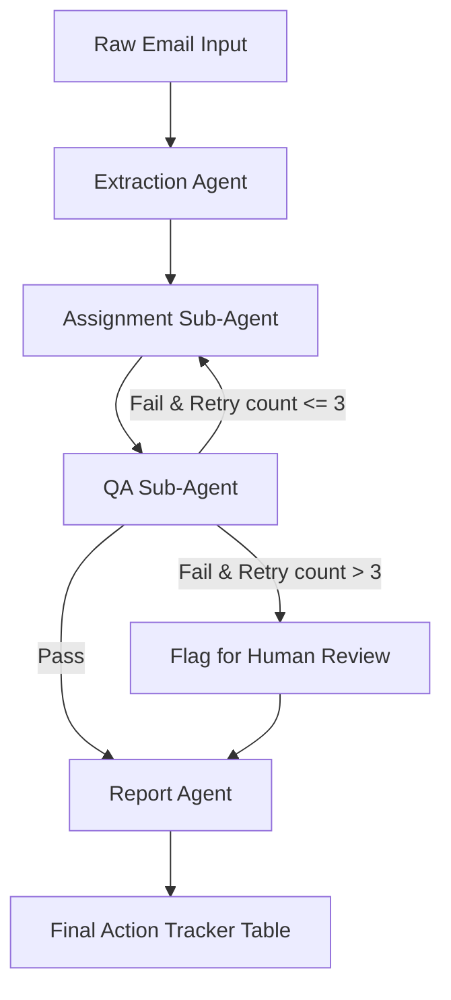

# Workflow: Email to Action Item Tracker

## Overview
This workflow coordinates four specialized agents to process raw email text into a structured, verified action item report with real-time feedback loops.

## Steps

### Step 1: Task Extraction
- **Agent**: Extraction Agent
- **Input**: Raw email text
- **Action**: Parse thread, identify task sentences, output array of draft task items.

### Step 2: Ownership & Deadline Assignment
- **Agent**: Assignment Sub-Agent
- **Skill**: `ownership-rules`
- **Input**: Draft task item + email context + retry feedback (if any)
- **Action**: Determine owner and deadline date/time.

### Step 3: Verification & Quality Check
- **Agent**: QA Sub-Agent
- **Skill**: `quality-check`
- **Input**: Assigned task item
- **Action**: Check for clear task + valid owner + deadline.
  - **Success**: Tag as `Verified`, forward to Report Agent.
  - **Failure (Retries <= 3)**: Broadcast retry event to activity log, pass back to Step 2 with hint.
  - **Failure (Retries > 3)**: Tag as `Needs Human Review`, forward to Report Agent.

### Step 4: Report Generation
- **Agent**: Report Agent
- **Input**: Verified and flagged items
- **Action**: Group by Owner, sort by Deadline, render final table.
